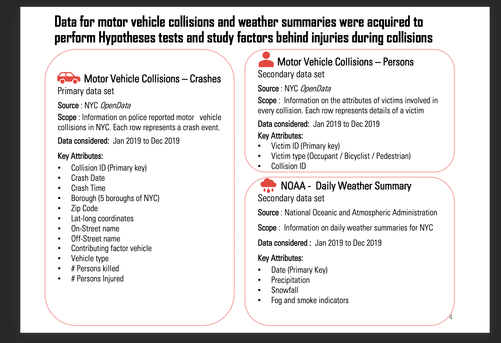

  ## New York Vehicular Collision Analysis and Prediction

## Abstract

Motor vehicle collisions cause an average of 38,000 deaths each year and an additional 2.35 million are injured or disabled. There were 33,654 fatal motor vehicle crashes in the United States in 2018 in which 36,560 deaths occurred, resulting in 11.2 deaths per 100,000 people. With such a high toll on human life, we wanted to understand what are the different factors that cause injuries during motor vehicle collisions. We wanted to analyze and present insights that would identify high-probability factors causing injuries during collisions and raise awareness about the next steps that can be taken to reduce the damage from them. For our study, we chose the NYC Motor Vehicle collision dataset covering a rich dataset of all the collisions that occurred in New York City in 2019. We probed deeper into the data and set up statistical tests to understand how differences in crash times, weather conditions, seasonality and driver’s alcohol and drug intake influence an injury developing from vehicular collisions. Further, we have represented a comprehensive summary describing the associations of various factors in causing an injury from a collision. Using a logistic regression model at its core, we have substantiated our results. Finally, we have presented our learnings from the analysis and highlighted the scope and future potentials of our work.

## Dataset Used 

## EDA

## Conclusion

